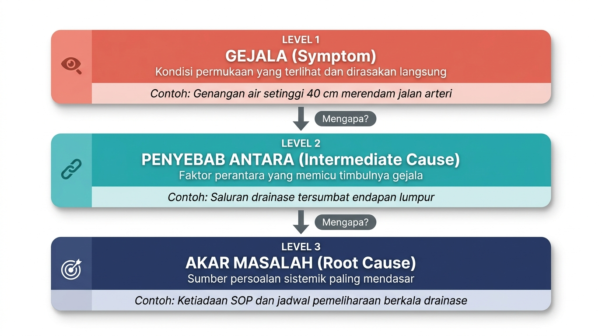
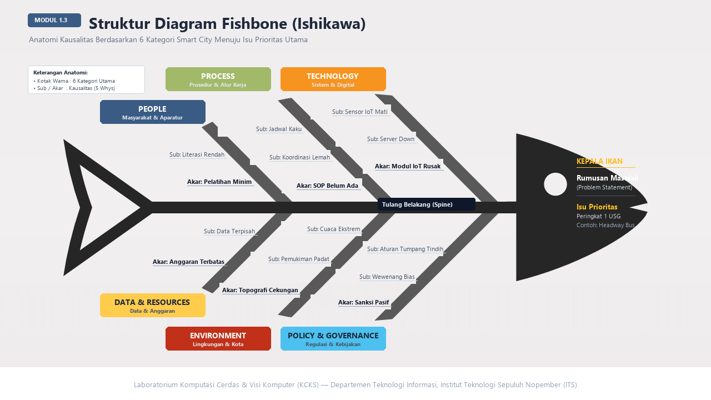
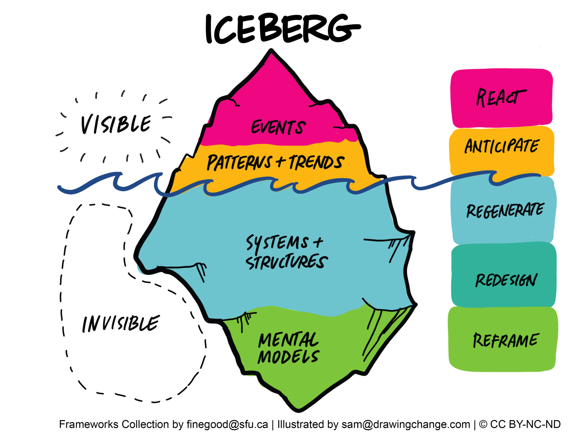
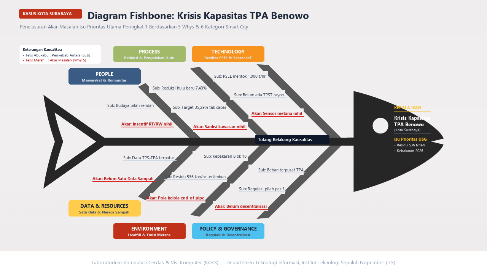

# Modul 1.3 Analisis Akar Masalah dan Pemeringkatan Isu

---

## 1. Tujuan Pembelajaran

Setelah mempelajari materi ini, kita diharapkan mampu:
- Membedakan antara gejala, penyebab antara, dan akar masalah.
- Menjelaskan fungsi metode APKL sebagai alat penyaringan isu.
- Menjelaskan fungsi metode USG sebagai alat pemeringkatan isu.
- Menerapkan metode APKL dan USG menggunakan rumus aktif pada spreadsheet.
- Memberikan justifikasi tertulis untuk setiap skor yang diberikan.
- Menyusun Diagram Fishbone dengan kategori yang sesuai untuk konteks Smart City.
- Menerapkan teknik 5 Whys untuk menemukan akar masalah.
- Memahami konsep Iceberg Model untuk menganalisis kedalaman masalah secara sistemik.
- Menghasilkan luaran berupa Diagram Fishbone (PNG) dan lembar kerja skoring (XLSX).

---

## 2. Pendahuluan

Pada Modul 1.2, kita telah mengamati fenomena perkotaan, mengeksplorasi konteksnya, memvalidasi bukti, dan merumuskan pernyataan masalah (*problem statement*).

Dari proses tersebut, biasanya diperoleh beberapa kandidat isu. Masing-masing tampak penting.

Namun, dalam pengelolaan kota yang sesungguhnya, pemerintah kota tidak dapat menyelesaikan semua masalah sekaligus. Selalu ada keterbatasan:
- anggaran daerah (APBD);
- waktu dan tenaga aparatur;
- infrastruktur teknologi;
- serta siklus perencanaan pembangunan (RPJMD/RKPD).

Karena itu, diperlukan cara yang sistematis untuk menentukan:

> *Dari sekian banyak isu, mana yang paling layak dan paling mendesak untuk ditangani terlebih dahulu?*

Tantangan lainnya adalah kecenderungan untuk langsung mengobati gejala yang terlihat di permukaan, tanpa menelusuri penyebab sesungguhnya.

Sebagai contoh, ketika sampah menumpuk di sudut-sudut kota, solusi yang sering muncul adalah menambah truk pengangkut atau membuat aplikasi pelaporan sampah. Namun, jika akar masalahnya terletak pada jadwal pengangkutan yang tidak teratur di tingkat rukun warga, maka solusi tersebut tidak akan menuntaskan persoalan.

Modul 1.3 membantu kita melakukan dua hal:
1. **Memilih satu isu prioritas** dari beberapa kandidat, menggunakan metode APKL dan USG.
2. **Menemukan akar masalah** dari isu prioritas tersebut, menggunakan Diagram Fishbone, teknik 5 Whys, serta Iceberg Model.

---

## 3. Gejala, Penyebab Antara, dan Akar Masalah

Sebelum melakukan analisis, kita perlu memahami bahwa suatu persoalan perkotaan memiliki beberapa lapisan.



### 3.1 Gejala

Gejala adalah kondisi permukaan yang langsung terlihat atau dirasakan.

Gejala biasanya menjadi hal yang pertama kali dikeluhkan masyarakat atau diberitakan media.

Contoh:
> Waktu tempuh bus kota pada jam sibuk meningkat menjadi 75 menit.

Gejala menunjukkan ada yang tidak beres. Namun, gejala belum menjelaskan **mengapa** kondisi tersebut terjadi.

Jika kita hanya mengatasi gejala, masalah yang sama akan muncul kembali.

---

### 3.2 Penyebab Antara

Penyebab antara adalah faktor yang secara langsung memicu timbulnya gejala. Faktor ini berada di lapisan tengah rantai sebab-akibat.

Contoh:
> Bus kota terjebak antrean kendaraan pribadi di persimpangan tanpa lajur khusus.

Banyak orang berhenti pada lapisan ini dan langsung merancang solusi. Padahal, masih ada pertanyaan yang lebih dalam: mengapa persimpangan tersebut tidak memiliki lajur khusus?

---

### 3.3 Akar Masalah

Akar masalah adalah penyebab paling mendasar. Jika akar masalah berhasil diatasi, masalah yang sama tidak akan terulang.

Akar masalah perkotaan biasanya berkaitan dengan:
- kelemahan kebijakan atau regulasi daerah;
- ketiadaan prosedur kerja standar (SOP);
- rendahnya kompetensi atau kesadaran aparatur dan masyarakat;
- kegagalan integrasi sistem data dan teknologi;
- atau alokasi anggaran yang tidak tepat sasaran.

Contoh:
> Belum ada regulasi pemberian hak lintas (*right of way*) untuk angkutan umum massal, dan belum ada integrasi lampu lalu lintas adaptif di pusat kendali.

> **Prinsip:**  
> Solusi Smart City yang baik harus diarahkan pada akar masalah, bukan pada gejala.

---

## 4. Mengapa Perlu Penyaringan dan Pemeringkatan?

Dari Modul 1.2, kita telah menghasilkan tiga kandidat isu. Semua isu tersebut mungkin valid dan didukung bukti.

Namun, kota memiliki keterbatasan:

```text
            BANYAK ISU PERKOTAAN
                     │
                     ▼
       ┌───────────────────────────┐
       │ KETERBATASAN SUMBER DAYA  │
       │ - Anggaran (APBD)         │
       │ - Waktu dan Tenaga        │
       │ - Kapasitas Teknologi     │
       │ - Prioritas RKPD/RPJMD   │
       └─────────────┬─────────────┘
                     │
                     ▼
         PENYARINGAN & PEMERINGKATAN
           (Metode APKL & USG)
                     │
                     ▼
            ISU PRIORITAS UTAMA
```

Untuk itu, kita perlu melalui dua tahap:
1. **Penyaringan (APKL)**: Menguji apakah setiap isu layak untuk diangkat.
2. **Pemeringkatan (USG)**: Dari isu yang layak, menentukan mana yang paling mendesak.

---

## 5. Penyaringan Isu dengan Metode APKL

Metode APKL digunakan untuk menguji kelayakan suatu isu sebelum diprioritaskan. Metode ini banyak digunakan dalam perencanaan kebijakan publik di Indonesia, termasuk dalam pedoman analisis isu dari Lembaga Administrasi Negara (LAN RI).

APKL menguji empat hal:

```text
                        APKL
                          │
       ┌──────────┬───────┴───────┬──────────┐
       ↓          ↓               ↓          ↓
    Aktual    Problematik    Kekhalayakan  Kelayakan
```

### 5.1 Aktual (A)

Apakah isu ini benar-benar sedang terjadi saat ini?

Isu yang aktual didukung oleh data terbaru (1–2 tahun terakhir), menjadi pembicaraan publik, atau tercantum dalam agenda pemerintah kota.

Isu yang sudah lama mereda atau belum terbukti secara empiris memiliki nilai aktualitas rendah.

---

### 5.2 Problematik (P)

Apakah isu ini benar-benar bermasalah dan perlu solusi?

Isu problematik memiliki kesenjangan (*gap*) yang besar antara kondisi nyata dan kondisi yang diharapkan. Isu ini menimbulkan dampak negatif dan mendesak untuk diselesaikan.

---

### 5.3 Kekhalayakan (K)

Apakah isu ini menyangkut kepentingan orang banyak?

Isu dengan kekhalayakan tinggi berdampak pada masyarakat luas, bukan hanya segelintir kelompok tertentu. Contohnya: akses transportasi umum, kualitas air bersih, atau pengelolaan sampah kota.

---

### 5.4 Kelayakan (L)

Apakah isu ini realistis untuk diselesaikan?

Isu yang layak berada dalam batas kewenangan pemerintah kota dan dapat diintervensi melalui inovasi teknologi, perbaikan proses, atau perubahan kebijakan daerah.

Isu yang berada di luar kewenangan kota (misalnya kebijakan moneter nasional) memiliki kelayakan rendah.

---

### 5.5 Rubrik Penilaian APKL

Setiap dimensi dinilai dengan skala 1 sampai 5. Berikut panduan penilaiannya:

#### Aktual (A)

| Nilai | Keterangan |
| :---: | :--- |
| **5** | Sedang terjadi saat ini; didukung data terbaru (kurang dari 1 tahun); menjadi sorotan publik dan prioritas pemkot |
| **4** | Terjadi berulang dalam 1–2 tahun terakhir; konsisten diberitakan dan tercantum dalam laporan dinas |
| **3** | Bersifat periodik atau musiman; didukung data 2–3 tahun terakhir |
| **2** | Mulai mereda; jarang tercatat di laporan resmi |
| **1** | Sudah terselesaikan di masa lalu; atau belum terbukti secara empiris |

#### Problematik (P)

| Nilai | Keterangan |
| :---: | :--- |
| **5** | Sangat kompleks; menimbulkan kerugian lintas sektor; sangat mendesak ditangani |
| **4** | Kompleks; mengganggu efisiensi layanan publik dan aktivitas ekonomi kota |
| **3** | Berdimensi sedang; dampak negatif terbatas pada sektor tertentu |
| **2** | Sederhana; gangguan bersifat minor dan masih terkendali |
| **1** | Tidak menimbulkan kerugian atau penyimpangan yang berarti |

#### Kekhalayakan (K)

| Nilai | Keterangan |
| :---: | :--- |
| **5** | Berdampak pada sebagian besar warga kota atau seluruh kawasan strategis |
| **4** | Berdampak pada banyak warga atau mencakup beberapa kecamatan utama |
| **3** | Berdampak pada sebagian warga atau terkonsentrasi di wilayah tertentu |
| **2** | Berdampak pada kelompok kecil atau wilayah terbatas |
| **1** | Hanya berdampak pada segelintir individu atau organisasi tertentu |

#### Kelayakan (L)

| Nilai | Keterangan |
| :---: | :--- |
| **5** | Sepenuhnya dalam wewenang pemkot; solusi teknologi sangat aplikatif dan realistis |
| **4** | Dalam wewenang pemkot; membutuhkan koordinasi moderat antar-dinas |
| **3** | Cukup realistis; namun membutuhkan penyesuaian regulasi atau anggaran yang signifikan |
| **2** | Kurang realistis; kewenangan utama berada di tingkat provinsi atau pusat |
| **1** | Tidak realistis untuk diselesaikan oleh pemkot; di luar kapabilitas yang ada |

---

### 5.6 Formula dan Ambang Batas

Total skor APKL dihitung dengan menjumlahkan keempat nilai:

> **Total Skor APKL = A + P + K + L**

Rentang skor: **4** (terendah) sampai **20** (tertinggi).

Aturan kelolosan:
- **Memenuhi Syarat**: Total skor 12 atau lebih, dan nilai Kelayakan (L) tidak bernilai 1.
- **Tidak Memenuhi Syarat**: Total skor di bawah 12, atau nilai L sama dengan 1. Isu ini tidak dilanjutkan ke tahap USG.

---

## 6. Pemeringkatan Isu dengan Metode USG

Isu-isu yang memenuhi syarat pada tahap APKL selanjutnya diperingkat menggunakan metode USG.

Jika APKL menjawab *"Apakah isu ini layak?"*, maka USG menjawab *"Dari yang layak, mana yang paling mendesak?"*

USG menilai tiga dimensi:

```text
                          USG
                           │
            ┌──────────────┼──────────────┐
            ↓              ↓              ↓
         Urgency      Seriousness       Growth
       (Ketersediaan  (Keparahan      (Kecepatan
          Waktu)        Dampak)       Memburuk)
```

### 6.1 Urgency (U) — Seberapa Mendesak?

Urgency menilai apakah isu ini membutuhkan tindakan segera.

Pertanyaan panduan:
- Apakah isu ini harus ditangani sekarang juga, atau bisa menunggu?
- Apa yang terjadi jika penanganan ditunda satu tahun?

---

### 6.2 Seriousness (S) — Seberapa Parah Dampaknya?

Seriousness menilai seberapa besar kerugian yang ditimbulkan oleh isu ini.

Kerugian dapat berupa:
- ancaman terhadap keselamatan dan kesehatan masyarakat;
- kerugian ekonomi dan perlambatan aktivitas kota;
- kerusakan lingkungan hidup;
- atau penurunan kualitas pelayanan publik.

---

### 6.3 Growth (G) — Seberapa Cepat Memburuk?

Growth menilai apakah isu ini akan semakin parah jika dibiarkan.

Pertanyaan panduan:
- Apakah dampak isu ini stabil, atau justru bertambah buruk dari waktu ke waktu?
- Apakah penundaan akan menimbulkan masalah ikutan yang lebih besar?

---

### 6.4 Rubrik Penilaian USG

#### Urgency (U)

| Nilai | Keterangan |
| :---: | :--- |
| **5** | Sangat mendesak; penundaan dalam hitungan minggu berakibat fatal bagi layanan kota |
| **4** | Mendesak; perlu penanganan dalam 3–6 bulan ke depan agar tidak meluas |
| **3** | Cukup mendesak; dapat dijadwalkan dalam siklus perencanaan tahunan (RKPD) |
| **2** | Kurang mendesak; penundaan tidak berdampak langsung pada stabilitas kota |
| **1** | Tidak mendesak; dapat ditunda tanpa konsekuensi yang berarti |

#### Seriousness (S)

| Nilai | Keterangan |
| :---: | :--- |
| **5** | Dampak sangat berat; berpotensi menimbulkan korban jiwa, kerugian ekonomi masif, atau kerusakan lingkungan permanen |
| **4** | Dampak berat; mengganggu produktivitas kota secara signifikan dan memicu biaya pemulihan tinggi |
| **3** | Dampak sedang; menimbulkan inefisiensi dan keluhan warga yang masih dapat dikelola |
| **2** | Dampak ringan; ketidaknyamanan minor pada kelompok terbatas |
| **1** | Dampak tidak signifikan; tidak menimbulkan kerugian yang nyata |

#### Growth (G)

| Nilai | Keterangan |
| :---: | :--- |
| **5** | Memburuk sangat cepat; eskalasi eksponensial dalam waktu singkat jika dibiarkan |
| **4** | Memburuk cepat; dampak meluas ke sektor lain dalam waktu kurang dari 1 tahun |
| **3** | Memburuk bertahap; seiring pertumbuhan penduduk dan aktivitas kota |
| **2** | Relatif stabil; tidak menunjukkan indikasi penyebaran yang signifikan |
| **1** | Statis; tidak ada risiko peningkatan keparahan di masa mendatang |

---

### 6.5 Formula dan Penentuan Peringkat

Total skor USG dihitung dengan menjumlahkan ketiga nilai:

> **Total Skor USG = U + S + G**

Rentang skor: **3** (terendah) sampai **15** (tertinggi).

Isu dengan total skor USG tertinggi menempati **Peringkat 1** dan ditetapkan sebagai **isu prioritas utama**.

> **Aturan jika skor sama (*tie-breaker*):**  
> Jika dua isu memiliki total skor yang sama, bandingkan secara berurutan:  
> 1. Nilai Urgency (U) tertinggi;  
> 2. Jika U sama, nilai Seriousness (S) tertinggi;  
> 3. Jika S sama, nilai Growth (G) tertinggi.

---

## 7. Perbedaan APKL dan USG

Kedua metode ini memiliki fungsi yang berbeda dan digunakan secara berurutan:

| | APKL | USG |
| :--- | :--- | :--- |
| **Fungsi** | Menapis kelayakan isu | Memperingkat isu berdasarkan kegawatan |
| **Pertanyaan** | *"Apakah isu ini layak diangkat?"* | *"Dari yang layak, mana yang paling mendesak?"* |
| **Posisi** | Tahap pertama (filter) | Tahap kedua (ranking) |
| **Hasil** | Status: Memenuhi Syarat / Gugur | Peringkat: 1, 2, 3, dst. |

APKL tanpa USG hanya menghasilkan daftar isu yang valid. USG tanpa APKL berisiko memeringkat isu yang seharusnya tidak layak diangkat.

Keduanya saling melengkapi.

---

## 8. Diagram Fishbone (Ishikawa)

Setelah menetapkan satu isu prioritas, langkah berikutnya adalah menemukan **mengapa** isu tersebut terjadi.

Diagram Fishbone (juga disebut diagram Ishikawa atau diagram tulang ikan) digunakan untuk memetakan hubungan antara suatu masalah dengan faktor-faktor penyebabnya secara terstruktur.

Diagram ini dikembangkan oleh Kaoru Ishikawa dan banyak digunakan dalam analisis kualitas serta pemecahan masalah.

### 8.1 Struktur Diagram Fishbone



Diagram ini terdiri dari:

1. **Kepala Ikan**: Berisi rumusan masalah (*problem statement*) dari isu prioritas.
   - Jangan menuliskan satu kata seperti *"Macet"*.
   - Tuliskan kalimat masalah yang spesifik, misalnya: *"Tingginya waktu tunggu feeder WiraWiri yang mencapai 25–35 menit pada jam sibuk di koridor komuter utama."*
2. **Tulang Belakang**: Garis horizontal utama yang mengarah ke kepala ikan.
3. **Tulang Utama**: Kategori besar faktor penyebab (misalnya People, Process, Technology).
4. **Tulang Cabang dan Ranting**: Penyebab yang lebih spesifik di dalam setiap kategori, diturunkan melalui pertanyaan *"Mengapa?"*.

---

### 8.2 Kategori Penyebab untuk Konteks Smart City

Dalam konteks perkotaan dan Smart City, kita dapat menggunakan 5 sampai 6 kategori berikut:

1. **People (Masyarakat & Aparatur)**  
   Kompetensi petugas, kepatuhan warga terhadap aturan, literasi digital, atau resistensi terhadap perubahan.

2. **Process (Prosedur & Alur Kerja)**  
   SOP yang tidak jelas, birokrasi yang berbelit, koordinasi antar-dinas yang lemah, atau mekanisme pengawasan yang tidak berjalan.

3. **Technology (Sistem & Infrastruktur Digital)**  
   Keandalan perangkat keras, sensor IoT yang tidak berfungsi, server yang sering *down*, atau aplikasi yang tidak terintegrasi satu sama lain.

4. **Data & Resources (Data, Anggaran, & Fasilitas)**  
   Data yang tidak mutakhir, format data antar-dinas yang berbeda, keterbatasan anggaran, atau kekurangan armada dan fasilitas fisik.

5. **Environment (Lingkungan & Geografi)**  
   Topografi wilayah (cekungan, pesisir), cuaca ekstrem, tata guna lahan, atau kepadatan pemukiman.

6. **Policy & Governance (Regulasi & Kebijakan) — opsional**  
   Peraturan daerah yang tumpang tindih, ketidakjelasan wewenang, atau lemahnya penegakan sanksi.

> **Catatan — Lensa Triple Transition:**  
> Dalam mengisi kategori Fishbone, kita juga dapat mempertimbangkan kerangka *Triple Transition* (Green, Digital, Inclusive) yang diperkenalkan oleh Prof. Rizal Sebastian pada CITIES International Conference 2025 di Surabaya. Kerangka ini membantu memastikan bahwa analisis penyebab mencakup tiga dimensi transisi kota cerdas secara seimbang:
>
> | Transisi | Pertanyaan Panduan untuk Fishbone |
> | :--- | :--- |
> | **Green** | Apakah penyebab ini berkaitan dengan keberlanjutan lingkungan, emisi karbon, atau ketahanan iklim? |
> | **Digital** | Apakah penyebab ini berkaitan dengan keterhubungan sistem, adaptasi terhadap kebutuhan pengguna, atau optimasi otomatis? |
> | **Inclusive** | Apakah penyebab ini memperburuk ketimpangan sosial, mengabaikan kelompok rentan, atau menghambat partisipasi warga? |

---

### 8.3 Perbedaan Issue Tree dan Fishbone

Kedua metode ini terkadang membingungkan atau keliru disamakan. Berikut perbedaannya:

| | Issue Tree (Modul 1.2) | Fishbone (Modul 1.3) |
| :--- | :--- | :--- |
| **Pertanyaan** | *"Dimensi mana yang perlu dipersempit?"* | *"Apa yang menyebabkan masalah ini terjadi?"* |
| **Fungsi** | Mempersempit ruang lingkup isu | Menelusuri penyebab dari isu yang sudah dipilih |
| **Isi cabang** | Aspek masalah (misal: tarif, rute, jadwal) | Faktor penyebab (misal: SOP tidak ada, server mati) |
| **Prinsip** | MECE (*Mutually Exclusive, Collectively Exhaustive*) | Cause & Effect dan teknik 5 Whys |

Singkatnya:
> Issue Tree memecah *"apa"* masalahnya. Fishbone menelusuri *"mengapa"* masalah itu terjadi.

---

## 9. Teknik 5 Whys

Teknik 5 Whys dilakukan dengan mengajukan pertanyaan *"Mengapa?"* secara berulang pada setiap cabang Fishbone, biasanya 3 sampai 5 kali, sampai ditemukan faktor paling mendasar yang berada dalam kendali sistem.

```text
MASALAH
    │
    ▼  Mengapa?
PENYEBAB TINGKAT 1 (kondisi di lapangan)
    │
    ▼  Mengapa?
PENYEBAB TINGKAT 2 (mekanisme operasional)
    │
    ▼  Mengapa?
PENYEBAB TINGKAT 3 (prosedur / kapasitas kerja)
    │
    ▼  Mengapa?
PENYEBAB TINGKAT 4 (kebijakan / sistem)
    │
    ▼  Mengapa?
AKAR MASALAH (root cause)
```

### 9.1 Contoh Penerapan

Misalkan isu prioritasnya adalah:  
*"Genangan air lambat surut di kawasan permukiman X setelah hujan deras."*

Berikut penurunan pada kategori **Process**:

| Tingkat | Pertanyaan | Jawaban |
| :--- | :--- | :--- |
| **Why 1** | Mengapa jalan tergenang? | Saluran drainase sekunder meluap karena pendangkalan sedimen |
| **Why 2** | Mengapa sedimen sangat tebal? | Pengerukan belum dilakukan sebelum musim hujan |
| **Why 3** | Mengapa pengerukan belum dilakukan? | Jadwal pengerukan tidak disusun berdasarkan data kondisi saluran |
| **Why 4** | Mengapa tidak ada jadwal berbasis data? | Pemeriksaan saluran masih dilakukan secara manual dan insidental |
| **Why 5** | **Mengapa pemeriksaan masih manual?** | **Belum ada sistem inventarisasi dan pemantauan aset drainase yang memicu jadwal pemeliharaan otomatis** |

Jawaban pada Why 5 adalah **akar masalah**.

> **Penting:**  
> Setiap jawaban "Mengapa" harus berdasarkan fakta atau data yang dapat diverifikasi, bukan spekulasi.

---

## 10. Analisis Berlapis dengan Iceberg Model

Selain Fishbone dan 5 Whys, kita dapat menggunakan **Iceberg Model** sebagai alat bantu untuk melihat isu secara lebih sistemik sebelum memetakan penyebab.

Iceberg Model dikembangkan dalam tradisi *systems thinking* dan banyak digunakan dalam analisis kebijakan publik. Model ini membagi sebuah persoalan ke dalam empat lapisan:



Secara visual, Iceberg Model mengilustrasikan bahwa apa yang tampak di permukaan hanyalah sebagian kecil dari persoalan sesungguhnya. Model ini membagi analisis ke dalam dua ranah utama:

1. **Di Atas Permukaan Air (*Visible / Terlihat Langsung*)**:
   - **Events (Peristiwa)**: Kejadian atau gejala yang tampak dan dirasakan langsung (*"Apa yang sedang terjadi?"*). Respons umum pada level ini biasanya hanya bersifat reaktif (**React**).
   - **Patterns + Trends (Pola & Tren)**: Peristiwa serupa yang terjadi berulang kali sepanjang waktu (*"Apakah ada tren berulang?"*). Respons pada level ini adalah mengenali pola untuk mengantisipasi (**Anticipate**).

2. **Di Bawah Permukaan Air (*Invisible / Akar Tersembunyi*)**:
   - **Systems + Structures (Sistem & Struktur)**: Aturan, regulasi, prosedur birokrasi, alokasi anggaran, atau relasi kekuasaan yang membentuk dan melanggengkan pola tersebut (*"Struktur apa yang memicu pola ini?"*). Tindakan pada lapisan ini adalah mendesain ulang (**Redesign**) atau memperbarui sistem secara menyeluruh (**Regenerate**).
   - **Mental Models (Model Mental)**: Keyakinan, nilai-nilai, asumsi dasar, atau budaya kerja yang melatarbelakangi terbentuknya sistem (*"Pola pikir apa yang melanggengkan struktur tersebut?"*). Intervensi paling fundamental adalah mengubah paradigma berpikir (**Reframe**).

### 10.1 Penjelasan Setiap Lapisan

| Lapisan | Pertanyaan Kunci | Contoh (Isu Banjir Kota) |
| :--- | :--- | :--- |
| **Event** | Apa yang terjadi? | Genangan air merendam jalan utama setelah hujan deras |
| **Pattern** | Apakah ini berulang? | Banjir terjadi setiap musim hujan di titik yang sama selama 3 tahun terakhir |
| **Structure** | Sistem apa yang membentuk pola ini? | Tidak ada SOP pengerukan berkala; anggaran pemeliharaan drainase tidak mencukupi |
| **Mental Model** | Asumsi apa yang melanggengkan? | "Banjir adalah bencana alam yang wajar" — sehingga penanganan bersifat reaktif, bukan preventif |

### 10.2 Hubungan Iceberg Model dengan Fishbone dan 5 Whys

Ketiga metode ini saling melengkapi:

```text
  ICEBERG MODEL              FISHBONE                    5 WHYS
  ─────────────              ────────                    ──────
  Melihat lapisan            Memetakan penyebab          Menggali kedalaman
  masalah secara             ke dalam kategori           setiap cabang hingga
  vertikal (Event →          (People, Process,           akar masalah
  Pattern → Structure        Technology, dst.)
  → Mental Model)

  "Seberapa dalam            "Dari mana saja             "Mengapa itu
   masalah ini?"              penyebabnya?"               terjadi?"
```

Kita dapat menggunakan Iceberg Model sebagai langkah awal untuk memahami kedalaman isu, lalu menggunakan Fishbone untuk memetakan penyebab secara terstruktur, dan 5 Whys untuk menurunkan setiap cabang hingga akar masalah.

> **Tips Praktis:**  
> Isi tabel Iceberg terlebih dahulu sebelum menggambar Fishbone. Lapisan *Structure* dan *Mental Model* dari Iceberg sering kali menjadi akar masalah yang ditempatkan di ujung cabang Fishbone.

---

## 11. Alur Kerja Modul 1 Secara Keseluruhan

Berikut adalah hubungan antar-modul dari Modul 1.1 hingga 1.3:

```text
┌─────────────────────────────────────────────────────────────┐
│ MODUL 1.1 — Landasan Konseptual & Data Kota                 │
│ - Memahami 6 pilar Smart City                               │
│ - Mengumpulkan data sekunder (BPS, Satu Data, RKPD)         │
└──────────────────────────────┬──────────────────────────────┘
                               │
                               ▼
┌─────────────────────────────────────────────────────────────┐
│ MODUL 1.2 — Identifikasi dan Formulasi Isu                  │
│ - Observe → Explore (5W1H) → Issue Tree                     │
│ - Validasi bukti (Claim – Evidence – Source)                │
│ - Menghasilkan 3 kandidat isu                               │
└──────────────────────────────┬──────────────────────────────┘
                               │
                               ▼
┌─────────────────────────────────────────────────────────────┐
│ MODUL 1.3 — Penyaringan (APKL) & Pemeringkatan (USG)          │
│ - Menguji kelayakan isu                                     │
│ - Menentukan 1 isu prioritas utama                          │
└──────────────────────────────┬──────────────────────────────┘
                               │
                               ▼
┌─────────────────────────────────────────────────────────────┐
│ MODUL 1.3 — Analisis Akar Masalah (Iceberg, Fishbone, 5Whys)│
│ - Memahami kedalaman isu secara sistemik                    │
│ - Memetakan faktor penyebab & menemukan akar masalah        │
└──────────────────────────────┬──────────────────────────────┘
                               │
                               ▼
┌─────────────────────────────────────────────────────────────┐
│ MODUL BERIKUTNYA — Perancangan Solusi Smart City            │
│ - Merancang solusi yang menyelesaikan akar masalah          │
└─────────────────────────────────────────────────────────────┘
```

---

## 12. Contoh Terapan: Kota Surabaya

Berikut adalah contoh lengkap penerapan APKL, USG, dan Fishbone menggunakan data riil Kota Surabaya yang telah dikumpulkan dan divalidasi pada Modul 1.1 dan Modul 1.2 (bersumber dari lembar kerja *Smart City Kelompok 7 — Surabaya*).

### 12.1 Tiga Kandidat Isu dari Modul 1.2

1. **Isu A — Smart Environment (Pengelolaan Persampahan)**  
   *Kesenjangan kapasitas olah aktif TPA Benowo terhadap volume timbulan sampah kota yang terus meningkat.*  
   - **Problem Statement**: Volume sampah yang masuk ke TPA Benowo (1.536,74 ton/hari pada 2024) sudah hampir menyamai kapasitas olah aktif fasilitas gasifikasi (1.000 ton/hari), menyisakan ±536,74 ton/hari tertimbun di landfill, sementara realisasi pengurangan sampah kota hanya 7,43% dari target resmi 35,29%, dan insiden kebakaran landfill pada Juli 2026 menunjukkan adanya tekanan operasional yang kritis pada pengelolaan akhir sampah kota.  
   - **Bukti Kunci**: Kepwali Surabaya No. 100.3.3.3/210/436.1.2/2025; Perwali Surabaya No. 64/2018; data timbulan sampah 1.810,81 ton/hari (Sheet 1.1); insiden kebakaran TPA Benowo Blok 1B seluas ±900 m² pada 19 Juli 2026.

2. **Isu B — Smart Environment & Living (Ketahanan Drainase & RTH)**  
   *Genangan air berulang akibat fasilitas pengendali air yang belum lengkap, di tengah ketiadaan data pemantauan RTH privat.*  
   - **Problem Statement**: Genangan berulang terjadi di berbagai titik Kota Surabaya setiap musim hujan — tujuh titik tercatat pada 5 November 2025, terparah di Tenggilis dan Tanjungsari — akibat fasilitas pengendali air (pompa, pintu air, box culvert) yang belum lengkap, di tengah RTH publik kota sebesar 20,32% yang telah memenuhi syarat minimum UU namun ketersediaan RTH privat (turut disyaratkan UU No. 26/2007 min. 10%) belum tercatat dalam data resmi kota.  
   - **Bukti Kunci**: Pernyataan resmi Kepala DSDABM Surabaya (November 2025); UU No. 26/2007 Pasal 29; capaian RTH publik 20,32% (Bappeda Surabaya, Sheet 1.1).

3. **Isu C — Smart Society & Economy (Kawasan Pesisir & Hunian Layak)**  
   *Kemiskinan nelayan dan status kumuh kawasan pesisir Kenjeran-Bulak di tengah kontras data zero kumuh dan tekanan proyek reklamasi.*  
   - **Problem Statement**: Nelayan tradisional dan buruh nelayan di kawasan pesisir Kenjeran-Bulak, termasuk Kel. Sukolilo Baru yang berstatus kumuh resmi (11,68 Ha/6.050 jiwa), menghadapi kemiskinan yang bertahan di tengah klaim Pemkot bahwa kawasan kumuh kota sudah 0% sejak 2019 — klaim yang kontras dengan data kumuh 43,46 Ha di 21 kelurahan dan sekitar 14.000 pengajuan bantuan hunian layak yang belum direspons — sementara rencana reklamasi pesisir (Surabaya Waterfront Land) dan stagnasi wisata Kenjeran Park menambah tekanan sosial-ekonomi mereka.  
   - **Bukti Kunci**: BPS Kota Surabaya (penduduk miskin 3,56% atau 105,09 ribu jiwa per Maret 2025); Ditjen Cipta Karya Kementerian PUPR (2017); riset Jurnal Hukum UNESA (2026); Jurnal MUKADIMAH (2025).

---

### 12.2 Tabel Penyaringan APKL

| No | Isu | A | P | K | L | Total | Status |
| :-: | :--- | :-: | :-: | :-: | :-: | :-: | :--- |
| 1 | **Isu A** — Kesenjangan kapasitas TPA Benowo & timbulan sampah | 5 | 5 | 5 | 5 | **20** | Memenuhi Syarat |
| 2 | **Isu B** — Genangan berulang & kelengkapan pengendali air / RTH | 4 | 4 | 4 | 4 | **16** | Memenuhi Syarat |
| 3 | **Isu C** — Kemiskinan nelayan & kekumuhan pesisir Kenjeran-Bulak | 4 | 4 | 4 | 4 | **16** | Memenuhi Syarat |

Justifikasi singkat:
- **Isu A (Skor 20)**: Mendapat nilai maksimal di seluruh kriteria karena TPA Benowo adalah satu-satunya TPA aktif kota (Aktual=5), kapasitasnya dinyatakan resmi hampir mencapai batas maksimal disertai kebakaran landfill (Problematik=5), menyangkut seluruh 3 juta penduduk kota (Kekhalayakan=5), dan berada langsung dalam wewenang otoritas Pemkot Surabaya (Kelayakan=5).
- **Isu B & Isu C (Skor 16)**: Keduanya memperoleh skor di atas ambang batas kelayakan (total $\ge 12$ dan tidak ada nilai $L=1$), sehingga seluruh kandidat isu dinyatakan **memenuhi syarat** untuk diuji lebih lanjut pada tahap USG.

---

### 12.3 Tabel Pemeringkatan USG

| No | Isu | U | S | G | Total | Peringkat |
| :-: | :--- | :-: | :-: | :-: | :-: | :--- |
| 1 | **Isu A** — Kesenjangan kapasitas TPA Benowo & timbulan sampah | 5 | 5 | 5 | **15** | **Peringkat 1** |
| 2 | **Isu B** — Genangan berulang & kelengkapan pengendali air / RTH | 4 | 4 | 4 | **12** | Peringkat 2 |
| 3 | **Isu C** — Kemiskinan nelayan & kekumuhan pesisir Kenjeran-Bulak | 4 | 3 | 4 | **11** | Peringkat 3 |

Justifikasi USG:
- **Urgency (U=5)** pada Isu A: Kepwali No. 210/2025 secara eksplisit menyatakan kapasitas TPA Benowo sudah hampir mencapai batas maksimal. Penundaan intervensi hulu akan menyebabkan penumpukan residu harian (±536,74 ton/hari) meluap tanpa alternatif penampungan lain.
- **Seriousness (S=5)** pada Isu A: Kebakaran landfill Blok 1B pada 19 Juli 2026 membuktikan bahwa akumulasi gas metana dari timbunan sampah menimbulkan risiko keselamatan, kesehatan lingkungan, dan gangguan operasional fasilitas vital di sekitarnya.
- **Growth (G=5)** pada Isu A: Volume sampah kota terus bertambah seiring populasi (timbulan 1.810 ton/hari), sementara realisasi pengurangan sampah dari sumber hanya 7,43% (jauh di bawah target 35,29%). Jika dibiarkan, laju akumulasi sampah akan melampaui daya dukung kota secara eksponensial.

**Keputusan: Isu A ditetapkan sebagai Isu Prioritas Utama (Peringkat 1).**

---

### 12.4 Diagram Fishbone untuk Isu Prioritas

Rumusan masalah pada kepala ikan (*effect*):  
> *"Kesenjangan kapasitas pengolahan aktif TPA Benowo terhadap volume timbulan sampah Kota Surabaya (residu ±536,74 ton/hari tertimbun di landfill dan insiden kebakaran Blok 1B)."*



Diagram di atas memetakan kausalitas persoalan ke dalam 6 kategori Smart City dengan penelusuran akar masalah menggunakan teknik 5 Whys:

1. **People (Masyarakat & Komunitas)**:
   - *Penyebab Antara*: Rendahnya budaya pemilahan sampah di sumber; kebiasaan membuang sampah secara tercampur.
   - *Akar Masalah (Why 5)*: **Belum tersedianya skema insentif dan disinsentif pemilahan sampah di tingkat RT/RW.**

2. **Process (Reduksi & Pengolahan Hulu)**:
   - *Penyebab Antara*: Realisasi pengurangan sampah di hulu kota baru mencapai 7,43%, terpaut jauh dari target resmi 35,29% (Perwali Surabaya No. 64/2018).
   - *Akar Masalah (Why 5)*: **Ketiadaan SOP inspeksi berkala dan sanksi tegas bagi pengelola kawasan mandiri/komersial yang tidak mengolah sampah sendiri.**

3. **Technology (Fasilitas PSEL & Sensor IoT)**:
   - *Penyebab Antara*: Kapasitas gasifikasi PSEL mentok di 1.000 ton/hari; belum tersedianya fasilitas olah antara (TPST 3R/pirolisis) skala rayon kota.
   - *Akar Masalah (Why 5)*: **Belum terpasangnya sensor pemantauan emisi metana dini dan instrumentasi IoT timbulan sampah di titik-titik transfer hulu-hilir.**

4. **Data & Resources (Satu Data & Neraca Sampah)**:
   - *Penyebab Antara*: Data timbulan sampah antar-TPS terputus dan pencatatan baru dilakukan saat truk memasuki jembatan timbang akhir TPA Benowo.
   - *Akar Masalah (Why 5)*: **Belum terbangunnya Sistem Satu Data Persampahan berbasis neraca sampah digital secara real-time.**

5. **Environment (Landfill & Emisi Metana)**:
   - *Penyebab Antara*: Lahan aktif landfill makin kritis akibat akumulasi residu harian ±536,74 ton/hari, memicu insiden kebakaran gas metana di Blok 1B seluas ±900 m² (19 Juli 2026).
   - *Akar Masalah (Why 5)*: **Manajemen persampahan kota masih bertumpu pada pola konvensional sentralisasi hilir (*end-of-pipe*).**

6. **Policy & Governance (Regulasi & Desentralisasi)**:
   - *Penyebab Antara*: Beban penanganan bertumpu sentralistis di TPA Benowo; regulasi pemilahan sampah belum mengikat secara operasional.
   - *Akar Masalah (Why 5)*: **Belum ada regulasi operasional yang mewajibkan desentralisasi pengolahan sampah tingkat kawasan permukiman dan komersial.**

---

### 12.5 Analisis Iceberg Model untuk Isu Prioritas (Krisis TPA Benowo)

Untuk memperkuat pemahaman sistemik sebelum merancang intervensi solusi Smart City pada tahap berikutnya, kita bedah persoalan krisis TPA Benowo ke dalam empat lapisan Iceberg Model:

| Lapisan | Pertanyaan Kunci | Temuan pada Isu TPA Benowo Surabaya | Respons Intervensi |
| :--- | :--- | :--- | :--- |
| **Event** *(Permukaan)* | Apa yang terjadi secara kasat mata? | Volume sampah masuk TPA Benowo (1.536,74 ton/hari) melampaui kapasitas olah aktif fasilitas gasifikasi PSEL (1.000 ton/hari); insiden kebakaran timbunan sampah di Blok 1B seluas ±900 m² (19 Juli 2026). | **React**: Pemadaman api darurat oleh DPKP, penutupan terpal/tanah di zona kebakaran, pengerahan ekskavator tambahan. |
| **Pattern** *(Tren Berulang)* | Apakah kejadian ini membentuk pola berkelanjutan? | Residu sampah tak terolah tertimbun ±536,74 ton/hari secara konsisten di lahan landfill; capaian reduksi sampah di hulu kota mandek di 7,43% (jauh tertinggal dari target resmi 35,29% Perwali No. 64/2018). | **Anticipate**: Menghitung sisa usia teknis zona landfill, memprediksi titik jenuh daya tampung, menambah shift operasional mesin gasifikasi. |
| **Structure** *(Sistem & Tata Kelola)* | Sistem, regulasi, dan koordinasi apa yang membentuk pola ini? | Tata kelola persampahan masih tersentralisasi di hilir (*end-of-pipe*); belum ada sistem Satu Data neraca sampah digital real-time antar-TPS; ketiadaan instrumen regulasi yang tegas (insentif/disinsentif) untuk memaksa pemilahan di sumber pada pengelola kawasan komersial dan pemukiman. | **Redesign / Regenerate**: Mendesentralisasi fasilitas olah antara (TPST 3R/pirolisis skala rayon); membangun sistem pemantauan IoT timbulan dan sensor metana; menyusun regulasi operasional kewajiban pilah berbasis RT/RW. |
| **Mental Model** *(Paradigma Dasar)* | Pola pikir atau asumsi apa yang melanggengkan struktur tersebut? | Anggapan umum masyarakat dan pengelola kawasan bahwa *"urusan sampah selesai setelah dibuang ke luar rumah/lingkungan"*, serta ketergantungan semu bahwa teknologi PSEL hilir sanggup menyerap semua beban tanpa perlu kita memilah sejak dari hulu. | **Reframe**: Mengubah cara pandang dari model konsumsi linear ("buang-kumpul-angkut") menjadi ekonomi sirkular; menanamkan kesadaran bersama bahwa pemilahan di hulu adalah kewajiban dasar warga kota cerdas. |

---

## 13. Contoh Terapan: Kota Surakarta (Iceberg Model + 5 Whys)

Berikut contoh penerapan Iceberg Model dan 5 Whys pada kasus nyata di Kota Surakarta, diambil dari Modul Penyusunan Policy Brief (CivicLab Academy × ITS × Taktis Consulting, 2026).

### 13.1 Masalah Awal

Warga di sekitar TPA Putri Cempo, Surakarta, terganggu oleh bau sampah yang pekat.

### 13.2 Analisis Iceberg Model

| Lapisan | Temuan |
| :--- | :--- |
| **Event** | Bau sampah menyengat tercium warga di sekitar TPA |
| **Pattern** | Bau muncul berulang, terutama saat aktivitas pemilahan sampah aktif |
| **Structure** | Kinerja pengolahan hulu (TPS 3R) belum optimal; beban timbunan di blok TPA sudah sangat tinggi |
| **Mental Model** | Menganggap bau TPA sebagai risiko yang harus diterima warga tanpa perlu intervensi tata ruang dan kebijakan operasional |

### 13.3 Analisis 5 Whys

| Tingkat | Pertanyaan | Jawaban |
| :--- | :--- | :--- |
| **Why 1** | Mengapa bau sangat mengganggu? | Terbawa embusan angin langsung ke arah permukiman dan area ladang |
| **Why 2** | Mengapa bau semakin pekat di luar area TPA? | Intensitas bau melonjak saat sampah sedang aktif dipilah |
| **Why 3** | Mengapa penanganan timbunan belum meredam dampak? | Beban timbunan di blok-blok TPA sudah sangat tinggi (mencapai blok D) |
| **Why 4** | Mengapa beban TPA terus meluber? | Kinerja pengolahan dari hulu (TPS 3R) belum optimal mengurangi volume sampah masuk |
| **Why 5** | **Mengapa belum teratasi komprehensif?** | **Belum terintegrasinya data spasial aktivitas warga (peternakan/permukiman) dalam dokumen kebijakan pengelolaan sampah** |

### 13.4 Isu Strategis yang Dirumuskan

> *"Optimalisasi Kebijakan Pengelolaan Sampah Berbasis Mitigasi Dampak Spasial di TPA Putri Cempo Surakarta (Timeframe RPJMD 2025–2029)."*

Perhatikan bahwa akar masalah yang ditemukan bersifat **struktural dan sistemik** — bukan sekadar masalah teknis operasional, melainkan menyangkut integrasi data dalam dokumen kebijakan.

---

## 14. Contoh Identifikasi Permasalahan Kota Metropolitan: Jakarta

Sebagai referensi tambahan, berikut ringkasan permasalahan Kota Jakarta berdasarkan dimensi Smart City, diambil dari dokumen *Potret Kota Jakarta Menuju Kota Cerdas Berskala Global* (Pemprov DKI Jakarta, 2024).

Tabel ini menunjukkan bagaimana sebuah kota besar mengidentifikasi isu per pilar Smart City secara sistematis — langkah awal sebelum penyaringan dan pemeringkatan dilakukan.

| Dimensi | Permasalahan Utama | Data Pendukung |
| :--- | :--- | :--- |
| **Smart Environment** | Kualitas lingkungan menurun dan emisi karbon tetap tinggi | Kenaikan temperatur 1,1°C selama 47 tahun; cuaca ekstrem naik 15–26% |
| **Smart Economy** | Ketimpangan sosial meningkat | Rasio Gini naik dari 0,32 (2007) menjadi 0,431 (2023) |
| **Smart People** | Kualitas SDM belum kompetitif secara global | Global Talent Index: Jakarta 30,1 vs Singapura 77,1 vs London 60,9 |
| **Smart Mobility** | Pergerakan manusia dan barang lambat | Rata-rata tempuh 18,75 km dalam 51 menit (Tokyo: 29,52 km dalam 38 menit) |
| **Smart Living** | Kualitas hidup tertinggal di kancah global | Rasio rumah layak huni turun dari 99,36% (2018) menjadi 38,8% (2023) |
| **Smart Branding** | *City branding* belum optimal | Wisatawan mancanegara: Jakarta 1,96 juta vs Singapura 13,6 juta |
| **Smart Government** | Transformasi digital pelayanan publik masih berjalan | Target percepatan SPBE dan ekosistem kota cerdas |

> **Catatan:**  
> Tabel di atas menunjukkan tahap awal identifikasi isu. Setelah isu-isu ini dikumpulkan, langkah selanjutnya adalah kita melakukan penyaringan (APKL) dan pemeringkatan (USG) untuk menentukan mana yang menjadi prioritas — persis seperti yang kita praktikkan di Modul 1.3.

---

## 15. Panduan Praktikum

### 15.1 Langkah Kerja

1. **Ambil 3 kandidat isu** dari penugasan Modul 1.2.
2. **Buat lembar kerja spreadsheet** (Excel atau Google Sheets) dengan dua tabel:
   - Tabel Penyaringan APKL
   - Tabel Pemeringkatan USG
3. **Isi skor 1–5** untuk setiap kriteria. Tuliskan justifikasi di kolom atau baris terpisah.
4. **Gunakan rumus aktif** untuk menghitung total skor dan ranking. Jangan mengetik angka secara manual.
5. **Buat Diagram Fishbone** untuk isu yang menempati Peringkat 1. Gunakan minimal 4–5 kategori dan turunkan setiap cabang dengan teknik 5 Whys.
6. **Ekspor** Fishbone ke format PNG dan simpan spreadsheet dalam format XLSX.

---

### 15.2 Contoh Tata Letak Spreadsheet

```text
TABEL PENYARINGAN APKL
┌────┬──────┬─────────────────────────┬───┬───┬───┬───┬────────────┬──────────────────┐
│ No │ Kode │   Rumusan Isu           │ A │ P │ K │ L │ Total Skor │ Status           │
├────┼──────┼─────────────────────────┼───┼───┼───┼───┼────────────┼──────────────────┤
│  1 │ ISU1 │ [Teks rumusan...]       │ 4 │ 4 │ 4 │ 4 │  =SUM()    │ =IF(Total>=12..) │
└────┴──────┴─────────────────────────┴───┴───┴───┴───┴────────────┴──────────────────┘

TABEL PEMERINGKATAN USG
┌────┬──────┬─────────────────────────┬───┬───┬───┬────────────┬──────────────────┐
│ No │ Kode │   Rumusan Isu           │ U │ S │ G │ Total Skor │ Peringkat (Rank) │
├────┼──────┼─────────────────────────┼───┼───┼───┼────────────┼──────────────────┤
│  1 │ ISU1 │ [Teks rumusan...]       │ 5 │ 5 │ 4 │  =SUM()    │ =RANK.EQ(...)    │
└────┴──────┴─────────────────────────┴───┴───┴───┴────────────┴──────────────────┘
```

---

### 15.3 Formula yang Wajib Digunakan

**Seluruh total skor dan ranking harus menggunakan rumus aktif. Dilarang mengetik angka manual.**

1. **Total skor APKL** (misal baris 4, kolom D sampai G):
   ```
   =SUM(D4:G4)
   ```
2. **Total skor USG** (misal baris 4, kolom D sampai F):
   ```
   =SUM(D4:F4)
   ```
3. **Ranking otomatis** (misal total skor USG di kolom G, baris 4–6):
   ```
   =RANK.EQ(G4, $G$4:$G$6, 0)
   ```
   Fungsi ini membandingkan nilai pada sel G4 terhadap seluruh total skor di G4:G6. Angka `0` berarti urutan menurun, sehingga skor tertinggi mendapat Rank 1.

4. **Status kelolosan APKL** (opsional):
   ```
   =IF(H4>=12, "Memenuhi Syarat", "Gugur")
   ```

---

### 15.4 Pembuatan Diagram Fishbone

Diagram Fishbone dapat dibuat menggunakan:
- **Draw.io / Diagrams.net** (disarankan, gratis)
- **Miro**
- **Canva**
- **FigJam / Figma**

Ketentuan:
- Kepala ikan harus berisi rumusan masalah yang spesifik.
- Minimal 4 sampai 5 kategori tulang utama.
- Setiap cabang diturunkan menggunakan teknik 5 Whys.
- Teks harus terbaca jelas, tidak terpotong.
- Ekspor dalam format **PNG** dengan resolusi minimal 1920 × 1080 piksel.

---

## 16. Luaran dan Ketentuan Pengumpulan

Kita perlu mengunggah dua berkas:

1. **Diagram Fishbone**
   - Format: `.png`
   - Nama file: `T1.3_Fishbone_[NRP]_[Nama].png`
   - Contoh: `T1.3_Fishbone_5026221001_AhmadFauzi.png`

2. **Lembar Kerja Skoring**
   - Format: `.xlsx` (berisi rumus aktif)
   - Nama file: `T1.4_Skoring_[NRP]_[Nama].xlsx`
   - Contoh: `T1.4_Skoring_5026221001_AhmadFauzi.xlsx`

---

## 17. Kesalahan Umum

Berikut kesalahan yang sering terjadi dan harus dihindari:

### Kesalahan 1 — Skor tanpa justifikasi
Memberikan nilai tanpa menuliskan alasan. Setiap skor harus disertai kalimat penjelasan mengapa nilai tersebut diberikan.

---

### Kesalahan 2 — Angka manual di spreadsheet
Menghitung total skor di luar spreadsheet lalu mengetiknya secara manual. Penilai akan memeriksa apakah sel-sel tersebut berisi rumus aktif.

---

### Kesalahan 3 — Fishbone berisi "ketiadaan solusi"
Menuliskan cabang seperti *"Belum ada aplikasi X"* atau *"Tidak tersedianya sensor Y"*. Fishbone mencari **penyebab masalah**, bukan mendaftar teknologi yang belum ada.

---

### Kesalahan 4 — Berhenti di gejala
Menuliskan penyebab yang sekadar mengulang gejala luar, misalnya *"Karena jalanan padat"*. Pertanyaan berikutnya yang harus diajukan adalah: *"Mengapa jalanan padat?"*

---

### Kesalahan 5 — Kategori tumpang tindih
Memasukkan faktor prosedur kerja ke kategori People, atau memasukkan faktor kebijakan ke kategori Environment. Setiap cabang harus ditempatkan pada kategori yang paling tepat.

---

### Kesalahan 6 — Isu baru tanpa bukti
Memunculkan isu baru di Modul 1.3 yang tidak pernah diobservasi atau divalidasi pada Modul 1.1 dan 1.2.

---

### Kesalahan 7 — Menyamakan Urgency dan Seriousness
Suatu masalah bisa sangat serius dampaknya, tetapi tidak mendesak jika tenggat penanganannya masih panjang. Urgency adalah soal **waktu**, Seriousness adalah soal **dampak**.

---

### Kesalahan 8 — Mengabaikan konteks kota
Menyusun penyebab secara teoretis umum tanpa memperhatikan kondisi nyata, geografi, dan kebijakan dari kota yang menjadi objek studi.

---

## 18. Ringkasan

| Tahap | Metode | Pertanyaan | Hasil |
| :--- | :--- | :--- | :--- |
| **Penyaringan** | APKL | *"Apakah isu ini layak diangkat?"* | Status kelayakan setiap isu |
| **Pemeringkatan** | USG | *"Mana yang paling mendesak?"* | Isu Peringkat 1 (prioritas utama) |
| **Pemahaman Sistemik** | Iceberg Model | *"Seberapa dalam masalah ini?"* | Kedalaman masalah (Event hingga Mental Model) |
| **Analisis Sebab** | Fishbone | *"Faktor apa yang menyebabkan masalah ini?"* | Peta penyebab berdasarkan kategori |
| **Penelusuran** | 5 Whys | *"Mengapa itu terjadi?"* | Akar masalah yang siap diintervensi |

> **Inti Modul 1.3:**  
> Menemukan akar masalah dan menetapkan satu isu prioritas secara terukur, agar solusi Smart City yang dirancang pada tahap selanjutnya benar-benar menyelesaikan sumber persoalan, bukan sekadar mengobati gejala.

---

## Daftar Pustaka

1. Andersen, B., & Fagerhaug, T. (2006). *Root Cause Analysis: Simplified Tools and Techniques* (2nd ed.). ASQ Quality Press.
2. CivicLab Academy, Taktis Consulting, & Institut Teknologi Sepuluh Nopember. (2026). *Modul Penyusunan Policy Brief: Dari Isu Strategis Menuju Rekomendasi Kebijakan*.
3. International Telecommunication Union. (2022). *Recommendation ITU-T Y.4903: Key performance indicators for smart sustainable cities to assess the achievement of the Sustainable Development Goals*. ITU.
4. Ishikawa, K. (1982). *Guide to Quality Control*. Asian Productivity Organization.
5. Ishikawa, K. (1986). *What is Total Quality Control? The Japanese Way*. Prentice-Hall.
6. Kementerian Komunikasi dan Digital Republik Indonesia. (2023). *Panduan Implementasi dan Masterplan Smart City Daerah*. Kemkomdigi RI.
7. Kepner, C. H., & Tregoe, B. B. (1997). *The New Rational Manager: An Updated Edition for a New World*. Princeton Research Press.
8. Lembaga Administrasi Negara Republik Indonesia (LAN RI). (2021). *Modul Pelatihan Kepemimpinan: Analisis Isu Kontemporer dan Teknik Analisis Kebijakan Publik*. Pusdiklat LAN RI.
9. Pemerintah Provinsi Daerah Khusus Jakarta. (2024). *Potret Kota Jakarta Menuju Kota Cerdas Berskala Global* (Buku 1). Jakarta Smart City.
10. Sebastian, R. (2025). *Creating smart, sustainable and inclusive cities* [Keynote speech]. CITIES International Conference, Surabaya.
11. UN-Habitat. (2024). *International Guidelines on People-Centred Smart Cities*. United Nations Human Settlements Programme.
